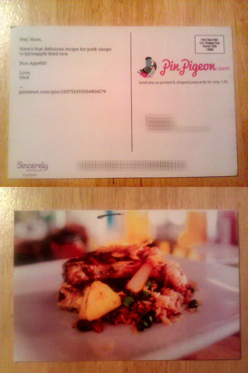
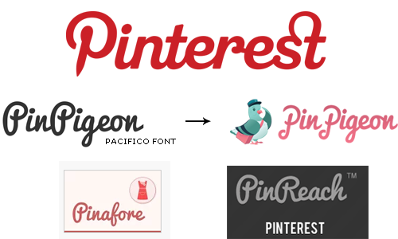
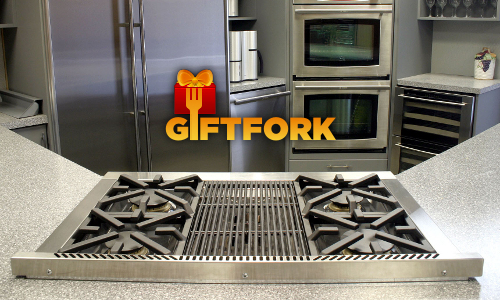
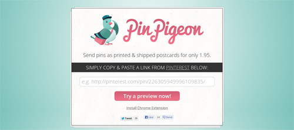
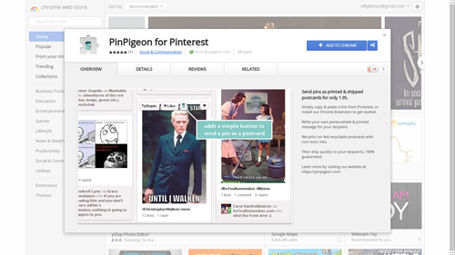

Pinterest threatened me with a C&D for PinPigeon, a service I made **-$251.42** with.
Yes, I know&hellip; that's negative dollars &ndash; I did not profit at all from this [micro-project][yegg],
but it was fun to build.  I enjoyed sending recipes as postcards to friends and probably ordered
more postcards than all my customers combined.  In response to Pinterest's threat, I've [shut it down][service-shutdown],
open sourced PinPigeon's [entire codebase][github] with the MIT license, and wrote about the story.

[service-shutdown]: http://pinpigeon.com
[yegg]: http://www.gabrielweinberg.com/blog/2010/08/rapid-prototyping-as-burnout-antidote.html
[ebay]: http://ebay.com
[github]: https://github.com/niftylettuce/pinpigeon.com



## Pinterest Reaches Out

On May 23, 2013 a legal representative of Pinterest, Inc. wrote to us&hellip;

> Hi I’m writing from Pinterest, recently we ran across your service and wanted to reach out to you. In general, we’re thrilled to see people contribute to the development of the Pinterest community. At the same time, we have to make sure our brand remains distinct. When other services use our trademarks and brands, it is bound to confuse users about the source of the services, or sponsorship , affiliation or endorsement by Pinterest. Ultimately, this diminishes the distinctiveness of our brand -- and yours. In order to avoid this confusion and the consequences that inevitably result, we ask you to:

> Remove the Pinterest logo, scripted “P” and “pin-” prefix from your service and any other materials associated (social network usernames, example: facebook.com/pinterestforbusiness) with the service.
> Rename your service so that features your brand prominently and not Pinterest’s brand/trademarks. You can find out more about our marks by referring to our logo and brand guidelines here.
> Clearly indicate that your service is not an official Pinterest service - after all you deserve the credit :)

> Please let us know whether you’re willing to make these changes. Thanks for your time, consideration and enthusiasm for Pinterest.

> **(name withheld)**

> Pinterest, Inc.

> <https://pinpigeon.com/>

> <https://chrome.google.com/webstore/detail/pinpigeon-for-pinterest/bokbjgfakkhkllopnpdpmpehhilhdple>

While this is a gentle email, it is the second threat from a startup I received.  I personally don't think startups should threaten each other like this.

Claiming to have dictionary-rights to the "pin-" prefix is a little odd, as is comparing a digital database of links and images to a physical postcard service.


### Reviewing Pinterest's Trademarks

Having trademarked a few brands myself before, I was curious to check the [USPTO][uspto] to see if Pinterest actually owned trademarks on everything claimed.

I discovered five (5) trademarks that are currently owned by Pinterest, Inc. and are all listed with a status of "active":

1. 85694131
2. 85685180
3. 85695361
4. 85255217
5. 85698998

To search for these serial numbers, go to <http://tess2.uspto.gov/>, click "Basic Word Mark Search", paste the serial number, and change "field" to "Serial or Registration Number".

The first two trademarks are of "stylized form", meaning they claim rights to a certain image.  <u>**HOWEVER**</u>, these trademarks do not claim color as a feature of the mark, so they have no trademark rights to their <strong style="color:#cb2127;">red hex color #cb2127</strong> (hmm).

The second two are of "standard characters", meaning they claim rights to the Pinterest "P" and the word "Pinterest" itself (pretty common).

The last trademark is a "standard character" mark for the word "pin".  This is a bit confusing, since after all Pinterest is publicly known as "Pinterest", not just "Pin".  Perhaps they should be filing a trademark for "Pin It" instead?  Does trademark law apply this way?

[uspto]: http://www.uspto.gov/

### Similar Services

Do they _only_ pick on open source developers that have indirectly helped their company (later mentioned)?
Maybe I just prepared a nice list of services that they'll soon send threats to (sorry in advance?).
These were just the ones I found in less than one hour of searching.

#### Chrome Webstore

An [extension search for "pinterest"][basic-search] yields dozens of results (since they list "pinterest" as a keyword in their `manifest.json` files).
Several of them are even using Pinterest's apparently _exclusive_ "pin-" prefix and a commonly used scripted font.
Many of these results also use Pinterest's name directly (or a slight variation thereof).  I would think that "PinPigeon" is distinguishable (it has a pigeon after all), but again, IANAL.
Also, a few of them directly copied the exact red hex color from Pinterest's logo!  These results include, but are not limited to:

[wikipedia]: https://en.wikipedia.org/wiki/Intellectual_property_protection_of_typefaces

* [**Pinterest** Contest][pinterest-contest]
* [Shareaholic for **Pinterest**][shareaholic]
* [**Pinterest** Button][pinterest-button]
* [**Pin**pockit][pinpockit]
* [**Pin**tubest][pintubest]
* [**Pin**afore][pinafore]
* [**Pin**ner for **Pinterest**][pinner-for-pinterest]
* [**Pinterest** Image Expander][pinterest-image-expander]
* [**Pinterest** Keyboard Shortcut][pinterest-keyboard-shortcut]
* [**Pin** Search][pin-search]
* [**Pin**Co][pinco]
* [**Pinterest** Tool][pinterest-tool]
* [**Pin**-up][pin-up]
* [**Pin**nutz][pinnutz] (also behind [**Pin**swish][pinswish] and [**Pin**n**pin**][pinnpin])
* [**Pinterest**+][pinterest-plus]
* [**Pin**t][pint]
* [**Pin**shop][pinshop]

I'm really curious if they've threatened these folks too.  Note that Pinterest Tool even has
the domain <http://pinteresf.org> &ndash; isn't it bizarre it's still online?

[basic-search]: https://chrome.google.com/webstore/search-extensions/pinterest
[pinshop]: https://chrome.google.com/webstore/detail/pinshop/encllmphepfnociponjajldbbmiohdoe
[pint]: https://chrome.google.com/webstore/detail/pint/lgbigfhiajcablghanoclnipiojgpgmn
[pinnpin]: https://chrome.google.com/webstore/detail/pinnpin/bcapaepdhmololkhgndiameibaneplhi
[pinterest-plus]: https://chrome.google.com/webstore/detail/pinterest%2B/fjcfnoccefkdkchnkajmhaohlomkgnfb
[pinswish]: https://chrome.google.com/webstore/detail/pinswish-accessorize-your/chggelafabaokemeopgjedbbhhanbinm
[quickpin]: https://chrome.google.com/webstore/detail/quickpin/bhogoimaoahmedeeahleijnpljdbammj
[pinnutz]: https://chrome.google.com/webstore/detail/pinnutz-pinterest-chat/bdcnfbhppgeiboglclnnmlkenfnjpnpi
[pin-up]: https://chrome.google.com/webstore/detail/pin-up-for-pinterest/jbimhddcjffophkbegbjiilmlhkfhohn
[pinterest-tool]: https://chrome.google.com/webstore/detail/pinterest-tool/mmldopniekkldgnpkkdijenbmobbiohk
[pinco]: https://chrome.google.com/webstore/detail/pinco-pinterest-collage-m/ojophemfchhilpedhkjibiegjogakdln
[pin-search]: https://chrome.google.com/webstore/detail/pin-search-image-search-o/okiaciimfpgbpdhnfdllhdkicpmdoakm
[pinterest-keyboard-shortcut]: https://chrome.google.com/webstore/detail/pinterest-keyboard-shortc/npbcjndbpajikchenclendcojmaeaphh
[pinterest-image-expander]: https://chrome.google.com/webstore/detail/pinterest-image-expander/ijjfcepcgakkhodjinacolfaeimnedbg
[pinner-for-pinterest]: https://chrome.google.com/webstore/detail/pinner-for-pinterest/ndiedfldbpmieeknpleihpglnhgonlni
[pinafore]: https://chrome.google.com/webstore/detail/pinafore/koknjbkknnhiigohiagkpaechjmplakb
[pintubest]: https://chrome.google.com/webstore/detail/pintubest/ciikmfjjeimaihonpjammebghhbdpkbl
[pinpockit]: https://chrome.google.com/webstore/detail/pinpockit/dpjjjeckcagljiffbiklhecbcmpjeopc
[pinterest-button]: https://chrome.google.com/webstore/detail/pinterest-button/fbfjhllmkehmda
[pinterest-contest]: https://chrome.google.com/webstore/detail/pinterest-contest/ffooapllmnbkomkknlmbkcocknhchbin
[shareaholic]: https://chrome.google.com/webstore/detail/shareaholic-for-pinterest/kfjkehmceppcpjoaoegdmffmkdhiegmc

#### Google Play Store

Outside of Chrome, I wondered what the distribution of Pinterest-related apps were amongst Android devices, so I sent a query for [another search][play-store].

Surprisingly there are "at least 1000 results" distributed as of today.  Not sure if all of them are related (probably just keyword blackhatting), but these ones stood out in particular:

* [**Pin**Hog][pinhog]
* [**Pin**4Ever **Pinterest** Backup][pin4ever]
* [**Pin**fetch][pinfetch]
* [Pocket Guide - **Pinterest** Mktg][pocketguide]
* [W**Pinterest**][wpinterest]
* [**Pin**foody][pinfoody]
* [**Pin**ternity for **Pinterest**][pinternity]

[pinternity]: https://play.google.com/store/apps/details?id=com.Pinternity&feature=search_result
[pinfoody]: https://play.google.com/store/apps/details?id=com.wPinFoody&feature=search_result
[wpinterest]: https://play.google.com/store/apps/details?id=com.wassupmobile.wpinterest&feature=search_result
[pocketguide]: https://play.google.com/store/apps/details?id=com.a751554674515548f3efa114a.a39705177a&feature=search_result
[pinfetch]: https://play.google.com/store/apps/details?id=jahn.piconi&feature=search_result
[pin4ever]: https://play.google.com/store/apps/details?id=com.HappyGirlApps.pin4everandroidgoogle&feature=search_result
[pinhog]: https://play.google.com/store/apps/details?id=net.solomob.android.pinhog3&feature=search_result
[play-store]: https://play.google.com/store/search?q=pinterest&c=apps

#### iTunes Store

While I was searching through the apps store, I came across an iTunes link and it spawned the question&hellip; how many Pinterest apps are in [available on iTunes][itunes-search]?

Here are a few of the results:

* [Bazaart - **Pinterest** Photo Collage App][bazzart]
* [Followers on **Pinterest**][followers-on-pinterest]
* [**Pin** for **Pinterest**][pin-for-pinterest]
* [**PinUploader** for **Pinterest**][pinuploader]

[pinuploader]: https://itunes.apple.com/app/id514430679
[pin-for-pinterest]: https://itunes.apple.com/us/app/pin-for-pinterest/id520885592?mt=12
[bazzart]: https://itunes.apple.com/us/app/bazaart-pinterest-photo-collage/id515094775?mt=8
[followers-on-pinterest]: https://itunes.apple.com/us/app/followers-on-pinterest-for/id547830910?mt=8
[itunes-search]: https://www.apple.com/search/?q=pinterest

#### Websites

On a more relative level, let's look at some websites that use the "pin-" prefix.  These were discovered with a [simple search on Google][simple-search]:

[simple-search]: https://www.google.com/search?q=pin+pinterest

* [**Pin**reach][pinreach]
* [**Pin**stamatic][pinstamatic]
* [Treasure **Pin**][treasury-pin]
* [**Pinterest** Alerts][pinterest-alerts]
* [**Pin** League][pin-league]
* [**Pinterest** Plugin][pinterest-plugin]
* [**Pin**booster][pinbooster]
* [**Pin**talk][pintalk]
* [**Pin**strosity][pinstrosity]
* [**Pin**ry][pinry]

[pinry]: http://getpinry.com/
[pinstrosity]: http://pinstrosity.blogspot.com/
[pinreach]: http://www.pinreach.com/
[pintalk]: http://pintalk.net/pinterest-pin-it-button/
[pinbooster]: https://pinbooster.com/
[pinterest-plugin]: http://pinterestplugin.com/
[pin-league]: http://pinleague.com/
[pinterest-alerts]: http://pinalerts.com/
[pinstamatic]: http://pinstamatic.com/
[treasury-pin]: http://treasurypin.com/


### Comparison of Logos &amp; Logotype

The commissioned artwork for PinPigeon was based off the free font [Pacifico][pacifico] and always appeared with our iconic pigeon logo.
We actually themed this logo after [MailChimp's][mailchimp] chimp (their service is great too by the way).

Several of the aforementioned apps also used this popular font, and many of them _actually_ decided to use Pinterest's exact hex color or a similar hue.

[By the way, you can't copyright a font][wikipedia] (but you can trademark its name, a brand image using it, and control licensing/distribution&hellip; though IANAL).



[pacifico]: http://www.fontsquirrel.com/fonts/pacifico
[mailchimp]: http://mailchimp.com/


## Building PinPigeon

### Sincerely's postcard API release

This service was built after I was introduced to [Sincerely][sincerely] from a friend and having met their team in-person.
While I was in uni, they held a hackathon and I placed third.  It was their first hackathon and it has remained my favorite hackathon in general since.
I heard the news when they first released their [Ship API for Web][ship-api], and thought&hellip;

> Wow&hellip; this means anyone can send a postcard to anyone in the world with a rather simple CURL request and just 99&cent;!

After you do some basic math (on top of [Stripe's][stripe] 2.3% + 30&cent; fee) &ndash; you're looking at a ~$0.62 profit if you markup the postcards to $1.95.
Soon after the release of this API, I decided to build them a Node.js [API wrapper][sincerelywrapper].
As an aside, Sincerely's team built top apps including [Postagram][postagram], [Ink][ink], and [Sesame][sesame].

[ship-api]: http://dev.sincerely.com/
[stripe]: http://stripe.com
[sincerely]: http://sincerely.com
[sincerelywrapper]: https://github.com/niftylettuce/node-sincerely>


### Delicious Recipes from Punchfork



For some reason or another, I thought it'd be cool to send recipes from [Jeff Miller's][jeff-miller] [Punchfork][punchfork] on postcards to friends.  I built a service called [Giftfork][giftfork], but didn't have time to focus on it.  It let you select meals from Punchfork to prepare as a "gift" for someone else &ndash; and then it would send a postcard to the gift recipient with the three-course meal you were to prepare for them.  I'm still not sure why I thought of that odd idea&hellip;

A few months passed and I realized that pinners might be an easier target market.  That spawned the idea of PinPigeon and it was hacked in one night during October of 2012.



Here's a [cached copy of the site][cache].  After [launching on Hacker News][hackernews-1] we had a bunch of sales ($21.45 worth).  This was not nearly enough to profit over the cost of Namecheap domain registration ($10.87), DigiCert SSL certificate ($87), commissioned logo ($100), and the DBA for PinPigeon, LLC ($75).

[cache]: https://webcache.googleusercontent.com/search?q=cache:pinpigeon.com

In retrospect, I could have just used PositiveSSL, StartSSL, or something cheaper like RapidSSL&hellip; but I did manage to get nearly 50% off Digicert (thanks guys).

To get more users, I thought of building a Chrome Extension to let users send postcards directly from Pinterest.  Perhaps this might drive traffic?  I shipped this idea in one afternoon and launched it on [Hacker News][hackernews-2].  I think we peaked at 28 users.




## Pinterest Blocks EC2 IP's

Since not many postcards were being sold (and since I had won a [StartupPack][startuppack]), I decided to switch from [Linode][linode] to Amazon EC2 and save some dough.

Two months ago I realized that Pinterest blocks EC2 IP addresses, which meant that my service was practically useless.  You would get a 500 error when trying to submit a Pinterest URL.  This was because our tech stack involved a server-side request to scrape Pinterest.

Before I found the answer to this issue on [StackOverflow][stack-overflow], I had the attention of Pinterest's support team&hellip; which leads me to think that this was their point of discovery.

<blockquote class="twitter-tweet"><p>@<a href="https://twitter.com/_higg">_higg</a> Thanks for the heads up. Looking in to it.</p>&mdash; Connor Montgomery (@connor) <a href="https://twitter.com/connor/status/327481647492640768">April 25, 2013</a></blockquote>
<script async src="//platform.twitter.com/widgets.js" charset="utf-8"></script>


[patent-pledge]: http://www.paulgraham.com/patentpledge.html
[linode]: http://linode.com
[stack-overflow]: http://stackoverflow.com/a/15886683
[startuppack]: http://startuppack.org
[hackernews-1]: https://news.ycombinator.com/item?id=4761002
[hackernews-2]: https://news.ycombinator.com/item?id=4868578
[giftfork]: https://twitter.com/giftfork
[postagram]: http://postagramapp.com
[ink]: https://sincerely.com/ink
[sesame]: http://sincerely.com/sesame


## Unfortunate Threat

I've decided to play my card this way and shut down the site.  Not going to waste time in court, as I'm more interested in exploring the ideas surrounding this situation.

Not sure of valid claims that could have been made, but here's a few thoughts:

1. Classification of trademark is for a completely different type of service (digital vs. physical).
2. Comparison of trademarks is easily distinguishable, one has a pigeon, one just has a big "P".
3. Pinterest does not have paying users, therefore its users can't possibly confuse us.
4. Iconic pigeon always appears with our logo mark, even our favicon was the pigeon head and not some "P".
5. Pinterest makes no claim to their red color.  Anyways, comparison of <span style="color:#f27288;">PinPigeon pink</span> to <span style="color:#cb2127;">Pinterest red</span> is like <span style="color: red;">apples</span>:<span style="color:orange;">oranges</span>.
6. Pinterest cannot copyright a font face.  They can't make a claim to a script type that is completely different.
7. Comparison of our typography shows completely different ligatures, kerning, spacing, casing, x-height, and even our "P" is completely different.
8. You can't trademark a dictionary word that is commonly used, and you certainly can't defend a trademarked word that you don't even use in your brand name&hellip; however, Apple owns the word Apple, and app store, and many other trademarks &mdash; so it seems to go by the size of your wallet as to what you can own.
9. Our service is clearly described as belonging to "PinPigeon, LLC.", a registered DBA (as opposed to "Pinterest, Inc.").  We're not charging users with Pinterest's corporation name.
10. Stripe credit card statements show "PinPigeon.com" for purchases made with our service.

While it is unfortuate they do not appreciate developers using their service for-profit &mdash; perhaps apps like these actually benefit them in the long run?

Maybe Pinterest should hook-in directly with Sincerely to send postcard gifts?

Since they use Django, I'm sharing this [snippet][snippet] of Python by [Leah Culver][leah-culver].  It demonstrates the ease of Sincerely's Ship Library:

```python
import json
import urllib
import urllib2

# Set up recipients array with two recipients
recipients = [
    {
        'name': 'John Smith',
        'street1': '1 Main St',
        'street2': 'Apt 208',
        'city': 'San Francisco',
        'state': 'CA',
        'postalcode': '94102',
        'country': 'United States'
    },
    {
        'name': 'Jane Doe',
        'street1': '123 Mission Street',
        'city': 'San Francisco',
        'state': 'CA',
        'postalcode': '94105',
        'country': 'United States',
    }
]

# Set up sender array
sender = {
    'name': 'Pepper Gram',
    'email': 'pepper@sincerely.com',
    'street1': '800 Market Street',
    'city': 'San Francisco',
    'state': 'CA',
    'postalcode': '94102',
    'country': 'United States',
}

params = {
    'appkey': 'YOUR_APPKEY_HERE',
    'testMode': True,
    'frontPhotoId': 123456,
    'recipients': json.dumps(recipients),
    'sender': json.dumps(sender),
}
data = urllib.urlencode(params)

req = urllib2.Request('https://snapi.sincerely.com/shiplib/create', data, {})
r = urllib2.urlopen(req)
resp = json.loads(r.read())
r.close()

if resp.get('success'):
    # Success!
    print resp
else:
    print 'An error occurred.'
```

[snippet]: https://gist.github.com/leah/d33fc5d4bbbb8940b6ac
[leah-culver]: http://leahculver.com/

If you liked this post, you might like reading Paul Graham's _[Patent Pledge][patent-pledge]_, or you could check out my other projects [Prove][getprove] and [Teelaunch][teelaunch].

[patent-pledge]: http://www.paulgraham.com/patentpledge.html
[getprove]: https://getprove.com
[teelaunch]: https://teelaunch.com

## Notes

* [Gittip][gittip] - while I was writing this article I discovered that people are tipping me on Gittip and I had no idea.
* [Pinry][pinry-github] - an open source alternative to Pinterest created with Python.
* Punchfork API - [Punchfork][punchfork] was created by [Jeff Miller][jeff-miller] and after quick traction, it was soon [acquire-hired][acquired-punchfork] by Pinterest.  Before the acquisition, I developed the [Punchfork API wrapper][punchfork-wrapper] for Node.js in collaboration with the Punchfork team.
* Pinterest API - they just released a [developer API][developer-api] two weeks ago, therefore scraping Pinterest may not be necessary after all!
* Iconfinder - If they really want to get strict about their [guidelines][guidelines], they should go look at this [list of icon results][icon-results].
* [Chicken Tortilla Soup][tortilla-soup] - one of my favorite recipes from Punchfork.
* [Pork Chops with Pineapple Fried Rice][porkchops] - another Pioneer Woman recipe.

[gittip]: https://www.gittip.com/niftylettuce/
[pinry-github]: https://github.com/pinry/pinry/
[guidelines]: http://business.pinterest.com/brand-guidelines/
[acquired-punchfork]: http://techcrunch.com/2013/01/03/pinterest-acquires-punchfork/
[porkchops]: http://thepioneerwoman.com/cooking/2012/03/pork-chops-with-pineapple-fried-rice/
[tortilla-soup]: http://thepioneerwoman.com/cooking/2011/01/chicken-tortilla-soup/
[developer-api]: http://developers.pinterest.com/
[icon-results]: http://www.iconfinder.com/search/?q=pinterest
[jeff-miller]: http://talkfast.org/
[punchfork-wrapper]: https://github.com/niftylettuce/node-punchfork
[punchfork]: http://punchfork.com
