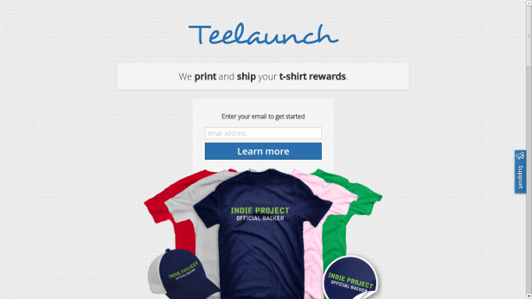
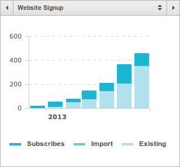
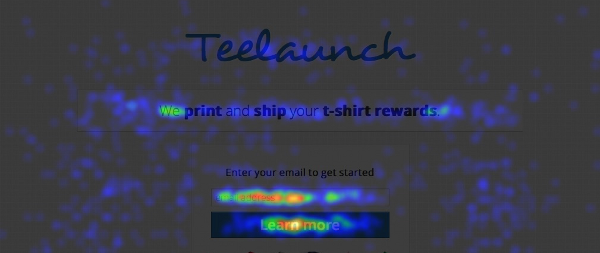
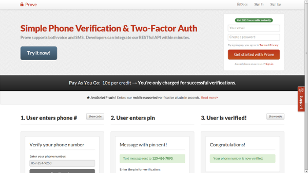

Since reading [Max Klein's blog](http://maxkle.in/blog) (before it was removed) and Gabriel's [post on micro-projects](http://www.gabrielweinberg.com/blog/2010/08/rapid-prototyping-as-burnout-antidote.html), I've become intrigued with micro-project validation.
In other words&hellip; how do I quickly ship an idea and analyze if it's a no-go?  How can I experiment rapidly to drive growth?  How can I leverage the open source community to build my product for me?  How can others become evangelists for my product?  How can I make my message clearer to increase conversion rates?

I shipped the following (2) micro-projects as weekend hacks&hellip;

## Teelaunch

> We print &amp; ship your t-shirt crowdfunding rewards &amp; more for Kickstarter, Indiegogo, RocketHub and other platforms!  Sign up for our t-shirt pricelist, t-shirt color chart, and t-shirt template!

* **Name**: Teelaunch
* **Website**: <https://teelaunch.com>
* **Date Launched:** January 2013
* **Revenue:** < $50K
* **Unique Visitors:** 13,793
* **Active Users:** 459
* **Conversion Rate**: ~3.32%
* **Effort Level:** Low (customers find us)
* **Growth Drivers:** [Teelaunch Badge](https://teelaunch.com/#embed), Indiegogo's blog ([#1](http://blog.indiegogo.com/2013/03/tool-time-e-sources-for-crowdfunding-campaigners.html) and [#2](http://blog.indiegogo.com/2013/05/4-ways-to-make-crowdfunding-fulfillment-easy.html)), [CrowdfundingPack](http://crowdfundingpack.org/), [WIRED](http://www.wired.com/design/2013/04/12-kickstarter-tools/?viewall=true)
* **Tech Stack:** Node, Jade, LESS, AWS, [MailChimp](http://eepurl.com/tAoNX), [Zapier](http://zpr.io/PghU), PayPal, Crazy Egg, and Google Analytics
* **Pros:** SEO is great, fulfillment/postage is completely automated, personal enjoyment from helping interesting crowdfunding projects (e.g. [FAKE GRIMLOCK](http://www.kickstarter.com/projects/531215105/me-fakegrimlock-the-book-of-awesome)), [Zapier](http://zpr.io/PghU) sends welcome emails automatically
* **Cons:** Manual PSD/AI quality control, customers don't always know what they want, artwork/revisions and sales funnel takes time

### MailChimp Subscriptions

> The subscription list _nearly doubled_ in May, due to Indiegogo's blog post [#2](http://blog.indiegogo.com/2013/05/4-ways-to-make-crowdfunding-fulfillment-easy.html).

### Crazy Egg Heatmap and Report

> Average user is from the United States, visits our site at midnight on Tuesday, and runs Chrome on Mac OS X &mdash; [Download Report](crazyegg.pdf)

## Prove

> Integrate phone verification in minutes.  Easily add SMS or phone call pin verification to your app.  Get 100 free credits just for signing up.

* **Name:** Prove
* **Website:** <https://getprove.com>
* **Date Launched:** April 2013
* **Revenue:** < $1K
* **Unique Visitors**: 4,869
* **Active Users:** 84
* **Conversion Rate:** ~1.72%
* **Effort Level:** High (customers hard to find)
* **Growth Drivers:** [60 Second User Retention](http://niftylettuce.com/posts/60-second-user-retention-with-mongodb-and-nodejs/), [Prove Plugin](https://getprove.com/docs#plugin) and [Twilio Partner Program](http://www.twilio.com/partners)
* **Tech Stack:** Node, Jade, LESS, AWS, Twilio, Stripe, and Google Analytics
* **Pros:** Open source community built the [API wrappers](https://github.com/getprove), service runs itself; no manual order processing
* **Cons:** Pay-as-you-go &ne; predictable income, not all users integrated with API yet

Teelaunch comes out on top between these (2) based on revenue and growth.
The guest blog posts _really_ drove traffic and the Teelaunch Badge on projects' pages connected us to customers that understood our business instantly.
I'm surprised that Prove's [JavaScript plugin](https://getprove.com/docs#plugin) hasn't attracted more developers (it even works great on mobile!).

If I was asked the question, "How can I validate a startup idea quickly?" &dash; I'd currently respond with these (3) steps (which is basically the same as Ryan Hoover's [email-first startup post](http://ryanhoover.me/post/43986871442/email-first-startups)):

1. Design a single-page website that's _very unique_.  Iterate on your verbiage carefully; simplify words and cut out as many as possible.  Don't use LaunchRock, write some clean HTML/CSS (it doesn't need to be responsive either; don't waste your time with that).
2. Add Google Analytics, MailChimp, and Zapier to automate analytics and connect with users.  Your call-to-action (email signup) should trigger a "zap" with Zapier to do something (e.g. send a welcome email or ask them a question).  You could just do this manually for now.
3. Ship within 48 hours.  Repeat steps 1-2 with a brand new idea.  Try experimenting with completely different domains.

Questions I'd like to ask&hellip;

1. What would be a clever way to drive growth for Prove? &mdash; _it's hard to get users integrating&hellip; should I suggest $X credit deposit for us to integrate for them?  Should I stop targeting developers, charge subscription rates, and focus on non-tech savvy folks?_
2. What are other domains with a similar model to Teelaunch? &mdash; _if you can automate/build 10x of these, then you could make money_
3. What are other ideas that simply monetize an existing API/service? &mdash; _similar to monetization of Twilio's API for Prove_
