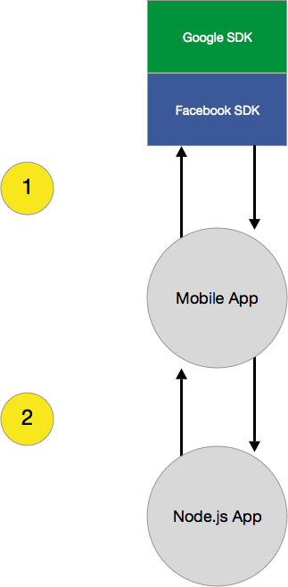
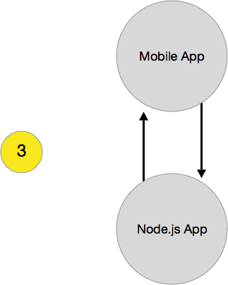

This is a brief walk-through for crafting a [Node.js][nodejs] powered RESTful API/server using [Eskimo][eskimo] (with [Passport][passport] for authentication strategies).  Eskimo is bundled with support for Email, Google, and Facebook auth strategies &ndash; which makes it rather easy to integrate on Web, iOS, and Android.  A custom Basic Authentication [policy](https://github.com/niftylettuce/eskimo/blob/750b3280684b5133b3dd8db41a200573cddeb8f1/boot/policies.js#L14-L42) using `basic-auth` is used as the auth strategy (the "glue") for API requests that require authentication (e.g. [users updating their stored profile information](https://github.com/niftylettuce/eskimo/blob/750b3280684b5133b3dd8db41a200573cddeb8f1/routes/api.js#L50-L62) from a mobile app).  If you're curious why Eskimo is used, it's because of its ease-of-use for [building Rapid MVP's with Node.js][building-rapid-mvps] &ndash; and most importantly it now has out-of-the-box support for this _entire_ walk-through.

## Background

Let's start by thinking of common questions related to this topic:

> How do I authenticate Facebook and/or Google with my RESTful API and iOS app?  Similarly, how do I do this for Android and Web? &mdash; and is there a simple way to normalize future API requests (that require auth) regardless of authentication strategy?

> How do I handle future requests with my iOS or Android app that require authentication?  For example, if my app shows a list-view of items, and the API endpoint to get those items requires authentication, how do I send my request to the endpoint?  Do I use the `access_token` from Facebook or a JWT with Google?  Do I use Basic Authentication somehow?

> How do I verify a [Google ID token][google-id-token]?  Similarly, how can I verify a [Facebook access token][facebook-access-token]?  Also, how can I be sure that these tokens are generated for my app and not someone elses?

> How can I use [Passport][passport] in my RESTful API and have it support both Web, iOS, and Android apps (with Email, Facebook, and Google authentication strategies)?

What are existing discussion threads related to these questions?

* [IOS Facebook Authentication Using node.js passport-facebook-token](https://stackoverflow.com/questions/18554890/ios-facebook-authentication-using-node-js-passport-facebook-token)
* [Passport Facebook Token Authentication Caching Possible?](https://stackoverflow.com/questions/24874937/passport-facebook-token-authentication-caching-possible)
* [iOS & node.js: how to verify passed access token?](https://stackoverflow.com/questions/11894506/ios-node-js-how-to-verify-passed-access-token)
* [iOS and Server: OAuth strategy](https://programmers.stackexchange.com/questions/154108/ios-and-server-oauth-strategy)
* [Oauth2 with nodejs](https://stackoverflow.com/questions/14528451/oauth2-with-nodejs)
* [What is the proper way to validate google granted OAuth tokens in a node.js server?](https://stackoverflow.com/questions/16312784/what-is-the-proper-way-to-validate-google-granted-oauth-tokens-in-a-node-js-serv)
* [How can I verify a Google authentication API access token?](https://stackoverflow.com/questions/359472/how-can-i-verify-a-google-authentication-api-access-token)

## Visualize Authentication Flow

**How do you design the authentication flow for Web, Android, and iOS using Node.js?**

Here's a simple mockup (created with [Sketch][sketch]) and its accompanied (and numbered) description &ndash; this demonstrates the flow of authentication with Eskimo:

1. Integrate the Facebook and Google SDK's into your Android or iOS mobile apps.  Add a "sign in" button and upon clicking it, it will initiate a sign in attempt with the SDK and return an `access_token` &ndash; or &ndash; simply have a user fill out a form with their email and password.

  

2. Send a `POST` request to the Node.js app API endpoint of `/api/auth/facebook` or `/api/auth/google` (depending on which SDK you're using).  In the request body, you should include `access_token` (and optionally `refresh_token` too).  The API will respond with a `user` object, of which you'll want to cache in the mobile app the value of `user.api_token`.  For example, here's how it'd look using `curl`:

  Mobile App Request:

  ```bash
  curl -X POST -d "access_token=123456789" \
      "http://localhost:3000/api/auth/facebook"
  ```

  Node.js App Response:

  ```js
  {
    "object": "user",
    "api_token": "VNaHU6UVbrV8BHUmfbXf3p2YKfG0lrTI"
    // ...
  }
  ```

  This API endpoint `/api/auth/:type` is configured to find or create the user based off the user's Facebook ID or the user's Google ID.  This allows us to have the same user sign in from Web, iOS, and Android &ndash; and have it all synced with one user account on our Node.js back-end.

  Eskimo ships with three API auth endpoint types:

  - `/api/auth/email`
  - `/api/auth/facebook`
  - `/api/auth/google`

  It also has support for Web-based authentication with Email, Facebook, and Google &ndash; to see this in action, simply start up Eskimo with `node app` and visit <http://localhost:3000/login>.  Note that you'll have to first configure `boot/config.js` with the strategy provider settings (see below).

  For example, here's how it'd look using `curl` for the `email` type endpoint:

  Mobile App Request:

  ```bash
  curl -X POST \
       -d "email=niftylettuce@gmail.com" \
       -d "password=123456" \
       "http://localhost:3000/api/auth/email"
  ```

  Node.js App Response:

  ```js
  {
    "object": "user",
    "api_token": "VNaHU6UVbrV8BHUmfbXf3p2YKfG0lrTI"
    // ...
  }
  ```

  If you have not yet registered this email address, then you can do so by sending a request to the `/api/auth/signup` route:

  Mobile App Request:

  ```bash
  curl -X POST \
       -d "email=niftylettuce%2Beskimo@gmail.com" \
       -d "name=Nifty" \
       -d "surname=Lettuce" \
       -d "password=123456" \
       "http://localhost:3000/api/auth/signup"
  ```

  Node.js App Response:

  ```js
  {
    "object": "user",
    "api_token": "VNaHU6UVbrV8BHUmfbXf3p2YKfG0lrTI"
    // ...
  }
  ```

  

3. In all future requests to endpoints that require authentication (e.g. requests to update my user account), send Basic Authentication headers to the respective endpoint.  The "user" param will be the user's `user.api_token` value (from step two above) and the "password" will be empty (since we want to account for instances where a user could change their email &ndash; and also for simplicity). For example, here's how it'd look using `curl`:

  Mobile App Request:

  ```bash
  curl -X PUT \
       -u "VNaHU6UVbrV8BHUmfbXf3p2YKfG0lrTI:" \
       -d "name=John" \
       "http://localhost:3000/api/user"
  ```

  Node.js App Response:

  ```js
  {
    "object": "user",
    "name": "John"
    // ...
  }
  ```

## Get Started with API Authentication using Eskimo

For the purposes of this article having a working example, we'll be using [Eskimo][eskimo] version `0.2.9`; as it has support for Facebook, Google, and Email strategies for both Web and API routes (e.g. `/auth/google/callback` and `/api/auth/google`) &ndash; however you can view source for Eskimo (namely these [two][this-commit] [commits][this-commit-two] &ndash; and pull what's necessary into your existing Node.js project).

1. Install Eskimo:

  ```bash
  # be sure to use the -g global flag
  npm install -g eskimo

  # make sure you have version >= 0.2.9
  eskimo --version
  ```

2. Create a new project:

  ```bash
  eskimo create my-project
  cd my-project
  npm install -d
  gulp postinstall
  ```

3. Generate and add provider configuration settings:

  **Google:** Go to <https://cloud.google.com/console/project> and create a new project &ndash; then go to "API's &amp; auth" &rarr; "Credentials" &rarr; "Create new Client ID" and add the following values:
  - Application Type: Web Application
  - Authorized JavaScript Origins: `http://localhost:3000`
  - Authorized Redirect URI's: `http://localhost:3000/auth/google/callback`

  Then copy/paste the Client ID and Client Secret Keys into the `settings.google` object of `boot/config.js`.

  Also be sure to go to "API'S &amp; auth" &rarr; "Consent screen" &ndash; and select an "EMAIL ADDRESS" and enter a "PRODUCT NAME" value (otherwise your Google auth strategies [will not work](https://stackoverflow.com/questions/18677244/error-invalid-client-no-application-name)).

  **Facebook:** Go to <https://developers.facebook.com/> and create a new "Website" application with a "Site URL" of `http://localhost:3000` (skip quick start wizard) &ndash; then copy/paste the App ID and App Secret Keys from "Settings" page into the `settings.facebook` object of `boot/config.js`.  Also go to "Settings" &rarr; "Advanced" and add a "Valid OAuth redirect URIs" value of `http://localhost:3000/auth/facebook/callback`.

  > **NOTE**: There is a well-known Facebook bug that appends the hash value of "#_=_" to the end of your URL upon a successful Facebook callback.  We've already implemented [my patch](https://github.com/jaredhanson/passport-facebook/issues/12#issuecomment-40427410) into `assets/public/js/fb-appended-hash-bug-fix.js` and it conditionally loads into `app/views/layout.jade` if `settings.facebook.enabled` is `true`.

4. Integrate the Google and Facebook SDK's into your Android and iOS apps (using the flow mentioned in [Visualize Authentication Flow](#visualize-authentication-flow)).  For making RESTful API requests from mobile apps to the Node.js app &ndash; you can use [AFNetworking][afnetworking] or [RestKit][restkit] for iOS &ndash; and [Retrofit][retrofit] for Android. You can simply search on Google for how to integrate the Google and Facebook SDK's into your mobile apps.

5. If you want welcome emails to get sent upon successful authentications, then you'll need to configure `settings.email` in `boot/config.js` (or `boot/local.js`) with a [nodemailer][nodemailer] transport object, for example:

  ```js
  // ...
  email: {
    // <https://github.com/andris9/Nodemailer>
    transport: {
      service: 'gmail',
      auth: {
        user: 'user@gmail.com',
        pass: 'abc123'
      }
    }
  },
  // ...
  ```

6. If you have any questions, then [join the Gitter chat room](https://gitter.im/niftylettuce/eskimo), email me at <niftylettuce@gmail.com>, and/or file an issue on GitHub at <https://github.com/niftylettuce/eskimo/issues/new>.

7. Good luck!


[this-commit-two]: https://github.com/niftylettuce/eskimo/commit/7006780303fe8c06c140f9e7c63bb3e7178c6a48
[this-commit]: https://github.com/niftylettuce/eskimo/commit/750b3280684b
[nodemailer]: https://github.com/andris9/Nodemailer
[nodejs]: http://nodejs.org
[building-rapid-mvps]: http://niftylettuce.com/posts/eskimo-rapid-mvp-node-boilerplate/
[afnetworking]: http://afnetworking.com/
[retrofit]: https://square.github.io/retrofit/
[restkit]: http://restkit.org/
[bootable-phase]: https://github.com/jaredhanson/bootable
[eskimo]: http://eskimo.io
[passport]: http://passportjs.org/
[facebook-access-token]: https://developers.facebook.com/docs/facebook-login/access-tokens
[google-id-token]: https://developers.google.com/accounts/docs/OAuth2Login#validatinganidtoken>
[sketch]: http://bohemiancoding.com/sketch/
